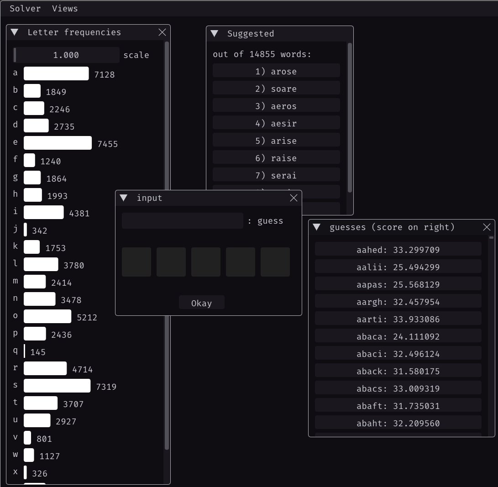

# Wordle Solver

A C++ program to help solve the game **Wordle** by filtering possible words and suggesting the best next guesses.



## Overview
This Wordle Solver filters through a dictionary of five-letter words to suggest the most likely candidates for the next guess. By marking letters as **green**, **yellow**, or **grey**, the solver helps narrow down possible solutions and provides helpful next guesses.

## Features
- Efficient filtering based on **green**, **yellow**, and **grey** letters.
- Suggestions for optimal next guesses.
- Customizable dictionary support.
- High-performance word filtering using bit fields in the `FilterQuerie` struct.

## Getting Started

### Prerequisites
- C++20 compatible compiler
- Visual Studio 2022 with C++ (If on Windows)
- glfw related modules (If on linux*)

### Building the Solver
1. Clone the repository:
   ```bash
   git clone --recursive https://github.com/gebriish/wordle-solver.git
   cd wordle-solver
2. Create Project Files:
   ```bash
   # ( for linux )
   ./premake/premake gmake2 
   # ( then just run make to compile )

   # ( for windows )
   ./premake/premake.exe vs2022
   ./WordleSolver.sln # ( change build config to release for best performance )

### How to use
- type your own input into the input field, or click one of the suggested guesses to select a word.
- cycle through the color options by clicking the five buttons to batch the wordle color response.
- Press okay, and continue the process.
